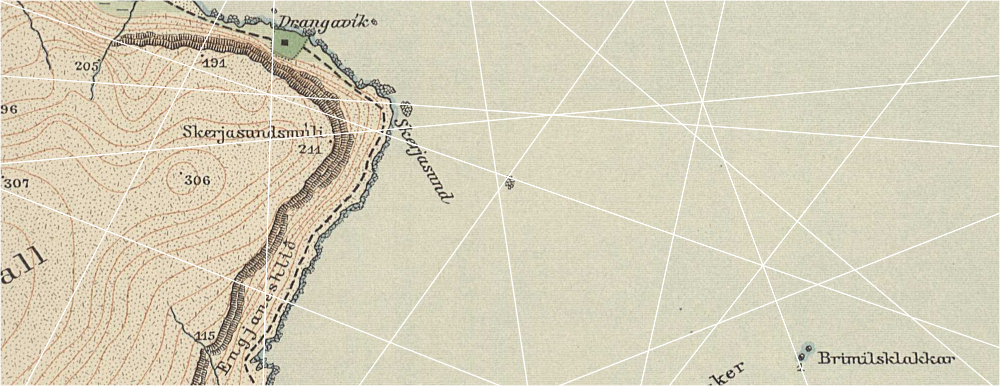
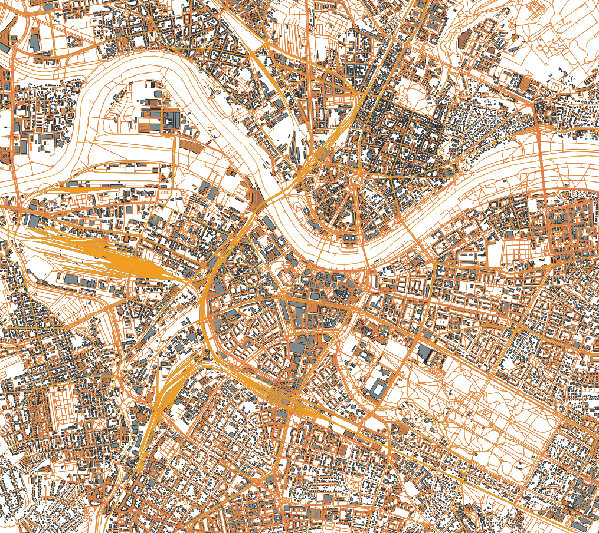
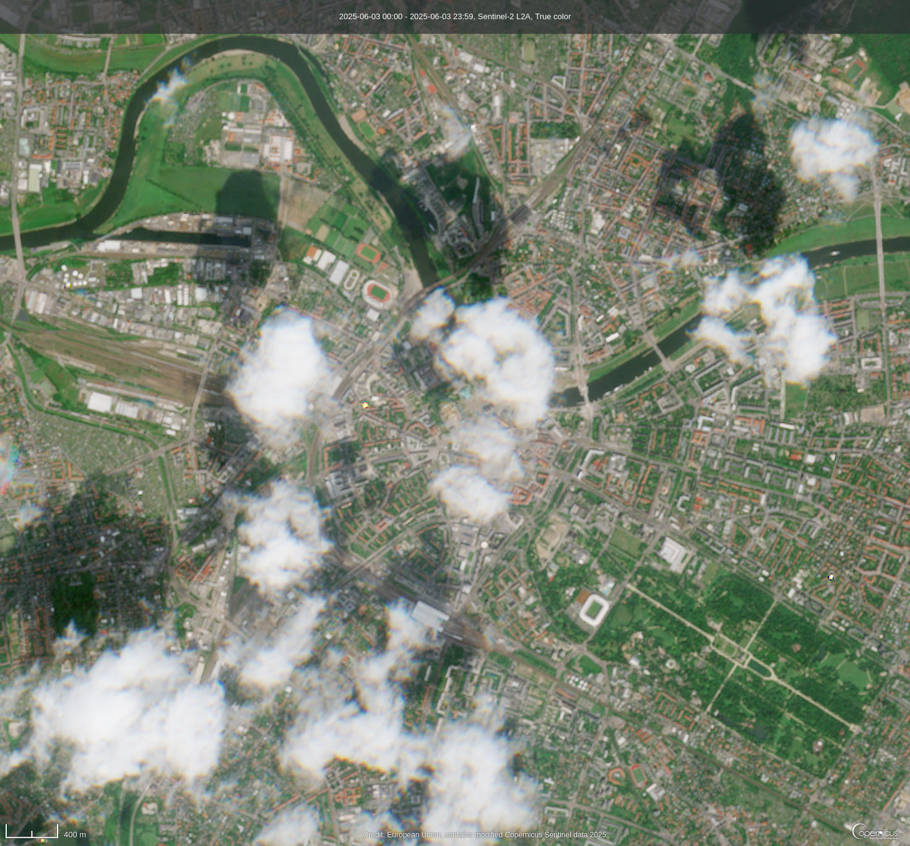
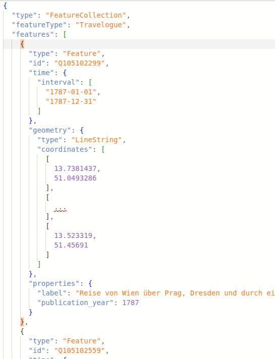

<!--
author: Arne Rümmler
language: de
mode:     Presentation
logo:   ./assets/slub.png
link: ./css/rue.css

@color: <span style="color: @0">@1</span>
@small:   <span style="font-size: 10pt">@0</span>
@normal:  <span style="font-size: 12pt">@0</span>
@xnormal: <span style="font-size: 13pt">@0</span>
@large:   <span style="font-size: 14pt">@0</span>
@xlarge:  <span style="font-size: 18pt">@0</span>
@xxlarge: <span style="font-size: 24pt">@0</span>
@huge:    <span style="font-size: 36pt">@0</span>

script:   https://cdn.jsdelivr.net/npm/mermaid@10.5.0/dist/mermaid.min.js
@onload
mermaid.initialize({ startOnLoad: false });
@end

@mermaid: @mermaid_(@uid,```@0```)

@mermaid_
<script run-once="true" modify="false" style="display:block; background: white">
async function draw () {
    const graphDefinition = `@1`;
    const { svg } = await mermaid.render('graphDiv_@0', graphDefinition);
    send.lia("HTML: "+svg);
    send.lia("LIA: stop")
};

draw()
"LIA: wait"
</script>
@end


-->


# Einführungskurs Spatial Humanities

@xlarge(`**@author**, *SLUB Dresden*`)


<div style="margin-top: 80px">
</div>



*Abbildung: Geodetic Institute, Copenhagen & Reykjavík, 1934, DGA map, via Wikimedia Commons*

<div class="bg-slide">

</div>


## Daten, Geodaten und Spatial Humanities

<figure style="float: right; width: 45%; margin-left: 40px; margin-bottom: 10px; text-align: center;">
  
  <figcaption style="font-size: 90%; font-style: italic;">*Abbildung: flaticon, CC BY-SA 4.0, via Wikimedia Commons*
</figcaption>
</figure>


@xlarge(`__Geodaten__ (räumliche Daten / spatial data) sind Daten die Information zu ihrer Position auf der Erde beinhalten.`)

@large(```
- Handyfoto (Koordinaten in Metadaten gespeichert)
- Regenradar
- Evakuierungzone bei Bombenfund
- Karten
- Aber auch weniger naheliegendes wie z.B. Epochen: *“... the Renaissance was first centered in the Republic of Florence, then spread to the rest of Italy and later throughout Europe.”*
```)


@xlarge(**Spatial Humanities** beantworten geisteswissenschaftliche Fragen mit Geodaten und räumlichen Analysemethoden.)


## Beispielfragestellungen

@large(```
**Datensatz:** *Die Digitalen Reiseberichte der Frühen Neuzeit in Sachsen* 
- https://reise.isgv.de/
- https://www.wikidata.org/wiki/Q105102869

1. Wie beliebt waren die verschiedenen Reiseziele?
2. In welche Richtung wurde hauptsächlich gereist?
```)

@xlarge(Vorgehen)

@large(```
1. Daten holen (→ SPARQL)
2. In geeignetes Format konvertieren (→ Python)
3. Visualisieren (→ kepler.gl)
```)


## Geodatenstrukturen: Raster und Vektor

@large(```
- Die zwei Haupttypen geografischer Daten sind **Raster**- und **Vektordaten**.

- Rasterdaten werden als Gitter aus Werten gespeichert, die als Pixel auf einer Karte dargestellt werden. Jeder Pixelwert repräsentiert ein Gebiet auf der Erdoberfläche.

- Vektordaten beschreiben spezifische Objekte auf der Erdoberfläche (Punkte, Linien, Polygone) und weisen diesen Attribute zu. 
```)

<div style="display: flex; align-items: flex-start; gap: 10px;">

  <div style="flex: 1;">
    <figure style="text-align: center;">
      
      <figcaption style="font-style: italic;">
        Abbildung: OpenStreetMap-Vektordaten (Data/Maps Copyright 2018 Geofabrik GmbH and OpenStreetMap Contributors)
      </figcaption>
    </figure>
  </div>

  <div style="flex: 1;">
    <figure style="text-align: center;">
      
      <figcaption style="font-style: italic;">
        Abbildung: Sentinel-2-Rasterdaten (Copernikus Browser, https://browser.dataspace.copernicus.eu)
      </figcaption>
    </figure>
  </div>

</div>


## Vektordaten

<div style="display: flex; align-items: start; gap: 40px;">
<div style="flex: 8;margin-top:30px;">

@large(```Vektordaten stellen konkrete Objekte auf der Erdoberfläche dar und verknüpfen diese mit Attributen.

* **Punkt:** Ein einzelnes Koordinatenpaar (z.B. ein Orte).
* **Linie:** Verbundene Punkte (z. B. Straßen, Flüsse).
* **Polygon:** Zu Flächen verbundene Punkte (z. B. Seen, Ländergrenzen).

Ein Vektorgeodatenobjekt, also der Zusammenschluss von Geometrie und Attributen, wird als **Feature** bezeichnet. Typische Attribute:

- Bezeichnung
- Zeitangabe
- Länge/Fläche
- ...

```)


</div>
<div style="flex: 6;">


*Abbildung: Punkte, Linien und Polygone (Quelle: National Ecological Observatory Network, NEON)*
</div>
</div>


## Vektordatenformate

<div style="display: flex; align-items: start; gap: 20px;">
<div style="flex: 1;">
**Shapefile `.shp`**

- Klassisches ESRI-Format (proprietär)
- Besteht aus: `.shp` (Geometrie), `.shx` (Index), `.dbf` (Attribute)
- Weit verbreitet, aber veraltet
- Zeichenbeschränkung für Attribute
</div>
<div style="flex: 1;">
@xlarge(```
**GeoJSON `geojson`/`json`**

- JSON-basiert
- Ideal für Webkarten (z. B. Leaflet, Mapbox)
- Unterstützt Punkte, Linien, Polygone und Sammlungen
- nicht standardisiert
```)

</div>
<div style="flex: 1;">
**GeoPackage `gpkg`**

- SQLite-basiert (eine Mini-Datenbank)
- Raster- & Vektordaten gemeinsam speicherbar
- Offener Standard (OGC)
- Gut für GIS Anwendungen geeignet (z.B. Datenanalyse oder Kartenerstellung)
</div>
<div style="flex: 1;">
**KML `.kml`/`.kmz`**

- Für Google Earth, Earth Engine
- XML-basiert
- unterstützt Styles -> Vermischung von Daten und Datenvisualisierung
- Gut in Google Ökosystem; nicht so gut außerhalb
</div>
</div>

<div style="margin-top:20px;">
</div>

<!--
data-marker="
1 0 1 135 rgba(255,0,0,0.6); 
"
-->
```ascii
+-----------+------------------+------------------+---------+------------------+---------------------------------------+
| Format    | Offener Standard | Web-Tauglichkeit | Kompakt | GIS-Tauglichkeit | Lesbar & verständlich für Menschen    |
+-----------+------------------+------------------+---------+------------------+---------------------------------------+
| Shapefile |       ✘          |        ✘         |    ✘    |        ✔         | ✘ Binärformat                         |
| GeoJSON   |       ∼          |        ✔         |    ✔    |        ∼         | ✔ Klarer Text, simple Struktur        |
| GPKG      |       ✔          |        ✘         |    ✔    |        ✔         | ✘ Binärformat                         |
| KML/KMZ   |       ✔          |        ✔         |    ✔    |        ∼         | ∼ XML-basiert, oft tief verschachtelt |
+...........+..................+..................+.........+..................+.......................................+
| Tabellen  |       ✘          |        ✘         |    ✔    |        ✘         | ✔ Sehr gut                            |
+-----------+------------------+------------------+---------+------------------+---------------------------------------+
```

**Tabellen `csv`/`xlxs`/...**

- kein eigentliches Geodatenformat, wird aber häufig verwendet
- nur für Punktdaten mit flachen Attributen geeignet
- sehr einfach zu verwenden

## GeoJSON


<div style="display: flex; align-items: flex-start; gap: 10px;">

  <div style="flex: 1;">
    ```mermaid @mermaid
classDiagram
    class FeatureCollection {
        +string featureType
    }

    class Features {
        +string id
    }


    class Properties {
        +string label
        +any other fields...
    }

    FeatureCollection --> Features : has 0..N
    Features --> Geometry : has 1
    Features --> Properties : has 0..N
    Geometry <|-- Point
    Geometry <|-- LineString
    Geometry <|-- Polygon
```
  </div>

  <div style="flex: 1;">
      
  </div>


</div>


